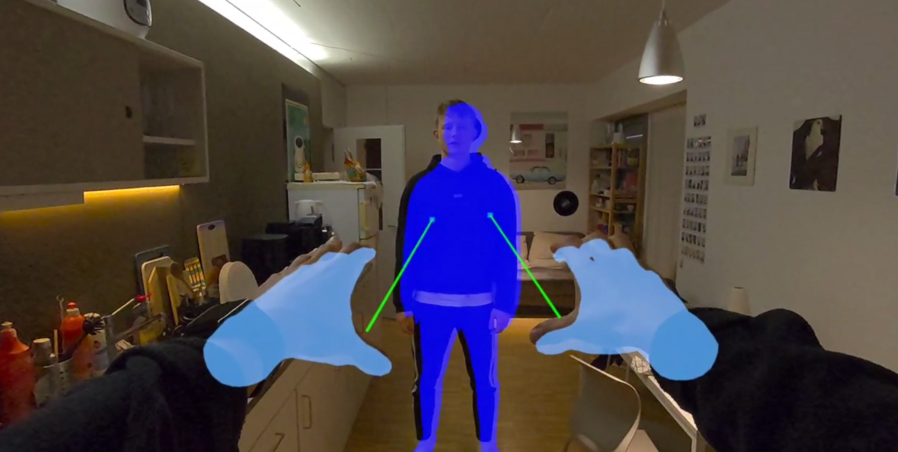

# Live Dynamic Object Masking on Meta Quest 3 for Robust 3D Reconstruction using SLAM

<p align="center">
  
</p>


SLAM systems typically assume static environments, which leads to degraded performance in scenes containing moving objects. In this project, we explore how externally computed **binary dynamic object masks** can be incorporated into a SLAM pipeline to mitigate this issue.

Our contributions include:
- A client–server Meta Quest system for interactive object selection and segmentation using SAM2
- Integration of dynamic object masks into DROID-SLAM by **zeroing per-pixel reprojection weights**
- Evaluation of masked vs. unmasked SLAM


This repository does not include full third-party codebases for SAM2 and DROID-SLAM. Instead, it contains only the files that were modified or added as part of this project. The modified files for mask integration in DROID-SLAM can be found in ``/src/external/DROID-SLAM`` including evaluation scripts and scripts for reconstruction. The app for the Unity client can be found in ``/Unity-PassthroughCameraApiSamples/Assets/DynamicObjectMasking_Client``.

---

## Dependencies

This project builds upon the following repositories:

* **DROID-SLAM**
BSD-3-Clause license
  [https://github.com/princeton-vl/DROID-SLAM](https://github.com/princeton-vl/DROID-SLAM)

* **SAM2**
  Apache 2.0 License,  BSD-3-Clause license
  [https://github.com/facebookresearch/sam2](https://github.com/facebookresearch/sam2)

* **Meta Passthrough Camera API Samples**
  Oculus SDK License Agreement
  [https://github.com/oculus-samples/Unity-PassthroughCameraApiSamples](https://github.com/oculus-samples/Unity-PassthroughCameraApiSamples)


DROID-SLAM and SAM2 are not included in this repository. You must clone them separately:

```bash
git clone https://github.com/princeton-vl/DROID-SLAM
git clone https://github.com/facebookresearch/sam2
```

And then copy the changed DROID-SLAM files from this repository into the corresponding locations inside the DROID-SLAM directory.

---

## Dynamic Mask Integration

Dynamic object masks are incorporated into DROID-SLAM by modifying the **reprojection weight tensor** during optimization. Pixels labeled as dynamic are assigned a weight of zero, effectively removing their influence from the bundle adjustment objective without altering the network architecture or correspondence estimation.

---

## Mixed Reality System

The MR frontend is implemented in Unity for the **Meta Quest 3** and uses hand tracking to allow users to select dynamic objects interactively. Segmentation is performed on a GPU server due to the computational demands of foundation models, while the headset handles camera capture, interaction, and visualization.

